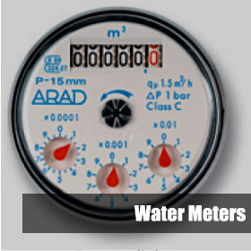
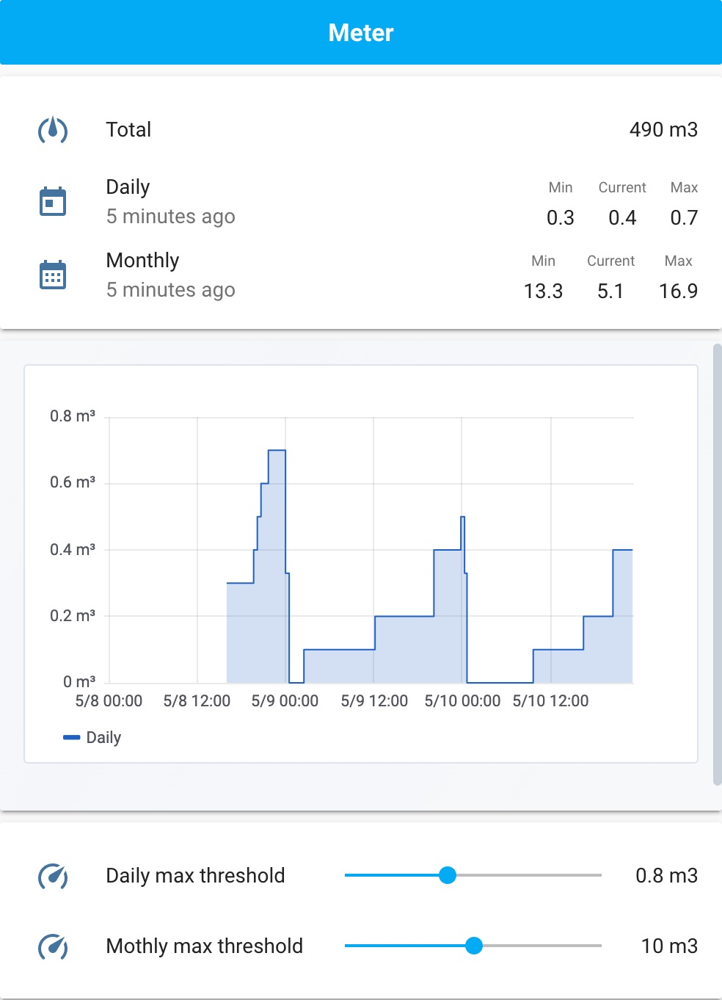

[](https://github.com/custom-components/hacs)

*Please :star: this repo if you find it useful*

<p align="left"><br>
<a href="https://paypal.me/eyalco1967?locale.x=he_IL" target="_blank"></a>
</p>

# Read Your Meter

The read your meter integration can be used to read your house water consumption and hopefully will enable you to save water and to early detect water leaks.



There is currently support for the following device types within Home Assistant:

- [Sensor](#sensor)

## Requirements

For the integration to work, you need the following:

- Account in read your meter
- Selenuim standalone chrome running on same device as Home Assistant.

### Install Selenuim

For installing [Sellenuim](https://www.selenium.dev/) please refer to the [offical documentation](https://www.selenium.dev/documentation/en/selenium_installation).

#### Raspberry PI

If you want to run the Sellenuim on Raspbery Pi, you can use the following command to download and start container with the following command:

```
docker run -d -p 4444:4444 --name selenium chadbutz/rpi-selenium-standalone-chrome
```

or with docker-compose

```
version: '2.1'

services:

  selenuim:
    image: chadbutz/rpi-selenium-standalone-chrome
    container_name: selenuim
    ports:
      - 4444:4444
    restart: unless-stopped
```

#### Ubuntu

For unbuntu, the offical image of selenuim can be used:


```
docker run -d -p 4444:4444 --name selenium selenium/standalone-chrome
```

### MANUAL INSTALLATION

1. Download the `read_your_meter.zip` file from the
   [latest release](https://github.com/eyalcha/read_your_meter/releases/latest).
2. Unpack the release and copy the `custom_components/read_your_meter` directory
   into the `custom_components` directory of your Home Assistant
   installation.
3. Configure the `read_your_meter` integration.
4. Restart Home Assistant.

### INSTALLATION VIA HACS

1. Ensure that [HACS](https://custom-components.github.io/hacs/) is installed.
2. Search for and install the `read_your_meter` integration.
3. Configure the `read_your_meter` integration.
4. Restart Home Assistant.

## Configuration

To enable this integration with the default configuration, add the following lines to your configuration.yaml file:

```yaml
read_your_meter:
  host: Selenuim host url
  username: Account user name
  password: Account password
```

|Parameter |Required|Description
|:---|---|---
| `username` | Yes | Account username
| `password` | Yes | Account password
| `host` | No | Selenuim url (path & port) **Default** http://localhost:4444
| `name` | No |  NOT SUPPORTED YET Sensors prefix **Default** Read your meter
| `scan_interval` | No | NOT SUPPORTED YET **Default**: 1800 sec
| `daily` | No | List of days information, starting 0 as today and up to 3 (three days ago). **Default** 0
| `monthly` | No | List of month information, starting 0 as this month and up to 3 (three month ago). **Default** 0
Here is an example for a configuration:

```yaml
# Example configuration.yaml entry

read_your_meter:
  host: http://localhost:4444
  username: john.brinston@gmail.com
  password: verycomplicatedpassword
```

## Sensors

### `sensor.read_your_meter`

```
state: Total water consumption

attributes:
	meter_number: Meter number
```

### `sensor.read_your_meter_daily`

```
state: Total water consumption daily

attributes:
   date: Rading day date
	avg: Last 30 days average consumption
	min: Last 30 days min value
	max: Last 30 days max value
	reading_state: E.g., approximate etc.
```

### `sensor.read_your_meter_daily_<x>`

```
state: Total water consumption daily (x days ago)

attributes:
   date: Rading day date
	reading_state: E.g., approximate etc.
```

### `sensor.read_your_meter_monthly`

```
state: Total water consumption monthly

attributes:
   date: Reading month date
	avg: Last 12 month average consumption
	min: Last 12 month min value
	max: Last 12 month max value
	reading_state: E.g., approximate etc.
```

### `sensor.read_your_meter_monthly_<x>`

```
state: Total water consumption monthly (x month ago)

attributes:
   date: Reading month date
	reading_state: E.g., approximate etc.
```

# Services

TBI

# Lovelace

An example view of Meter data. It includes:

- Meter data
- Daily graph (Grafana IFrame)
- Threshold for exceeded notifications



### Threshold Cards

```
  - type: entities
    show_header_toggle: false
    entities:
      - type: custom:slider-entity-row
        entity: input_number.water_meter_daily_threshold
      - type: custom:slider-entity-row
        entity: input_number.water_meter_monthly_threshold
```

# Automations

The following example shows how to be notified when unusual daily usage has exceeded some threshold.

Threshold input:

```
input_number:
  water_meter_daily_threshold:
    name: Daily Max Threshold
    icon: mdi:speedometer
    unit_of_measurement: "m3"
    min: 0
    max: 2
    step: 0.1
```

Notification Automation:

```
automation:
	- alias: Notify daily water usage exceed threshold
	  trigger:
	    - platform: state
	      entity_id: sensor.read_your_meter_daily
	  condition:
	    - condition: template
	      value_template: "{{ states('sensor.read_your_meter_daily') | float >= states('input_number.water_meter_daily_threshold') | float }}"
	  action:
	    - service: notify.Telegram
	      data_template:
	        message: >
	          Daily water usage {{ states('sensor.read_your_meter_daily') }} has exceeded daily threshold, please check for leaks.
  
```

---

I put a lot of work into making this repo and component available and updated to inspire and help others! I will be glad to receive thanks from you — it will give me new strength and add enthusiasm:
<p align="center"><br>
<a href="https://paypal.me/eyalco1967?locale.x=he_IL" target="_blank"></a>
</p>